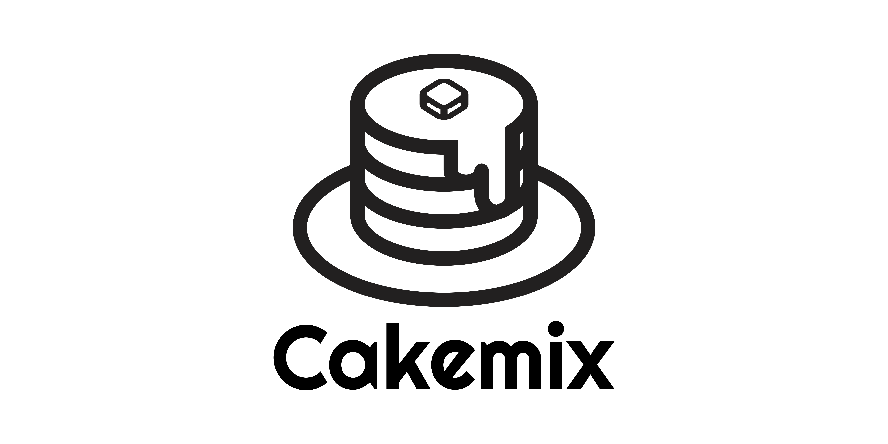

# Cakemix




[](LICENSE)


Cakemix is opensource document management system for all creative team.  
You can make a small team, folder and document on the Cakemix, also write a document with markdown, and edit with multiple users in realtime.  

# Features

- [x] Opensource(MIT)
- [x] Write document with markdown
- [x] Edit document with multiple users in realtime
- [x] Make document folder
- [x] Make small team
- [x] Security
- [x] Support PWA
- [x] Support Mobile-Friendly Design

# Demo

You can easily use demo of Cakemix. You should try it from here!  
[DEMO](https://hotcakemix.com)

# How to use

This repository is server side of Cakemix, you need front side ([here](https://github.com/wonder-wonder/cakemix-front)) to use Cakemix.

## Installation
### Fast way (using docker)
Please prepare front data directory in project root as `dist` in advance.

``` sh
docker network create shared-network # Create network for public
make runprod                         # Build docker image and start
# When you want to stop server...
make down
```
Now you can access `localhost:8081` to use cakemix!

## For developer
### How To run for development
``` sh
make startdb  # Start database server on docker
make rundev   # Start server for development
# After testing
make stopdb   # Stop database server
```

## Envrionment variables
- Database
  - `DBHOST` is hostname for postgres database (default: )
  - `DBPORT` is port number for postgres database (default: )
  - `DBUSER` is user for postgres database (default: )
  - `DBPASS` is password for postgres database (default: )
  - `DBNAME` is database name for postgres database (default: )

- Mail
	- `SENDGRID_API_KEY` is SendGrid API Key. If `DEBUG` is specified, mail content will be shown in the log. If empty, the mail function will be disabled. (default: )

## Cakemix Release Policy
### Branches
- main
  - latest stable version
- release/vx.x.x
  - bata version (release candidate)
- develop
  - alpha version (version of developing phase)
- feat/xxx
  - branch for implementation a feature or fixing a bug 
- hotfix/xxx
  - branch for fixing a bug that existing main branch and it needs to fix as soon as possible

```
feat/xxx        x     x
              /   \ /   \
develop   ---x-----x-----x-------x---x----- (PR required)
                    \           /    |
release/x            x--x--x   /     |
                            \ /      |
main      -------------------x-------x----- (PR required)
                              \     /
hotfix/x                         x
```

### Versioning (Major.Minor.Patch)
#### Major
- will increment when breaking changes occurred
#### Minor
- will increment when new features are added
#### Patch
- will increment when bugs are fixed

# License

**Released under the [MIT license](LICENSE)**